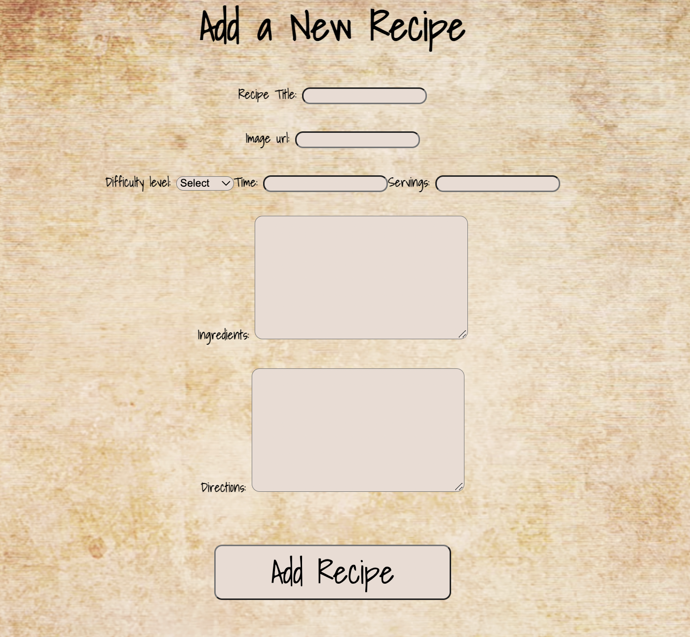

# Food Diary

## By: Aekangi Patel

[Facebook](http://www.instaa.com)
[Instagram](http://www.instaa.com)
[Twitter](http://www.instaa.com)

## Description

Here, I have created 1 food diary that has 2 different diaries combined. From the homepage, you have access to both: the Dinner Diary and the Mocktail Diary. Both diaries will lead you to wonderful recipes that when clicked, will show you all the recipe information. Through the app, I have bulit multiple features: you are able to add a recipe, update the recipe or just simply delete a recipe if you dislike it! To create this project, I have used multiple different technologies such as, Mongoose, Express, React, Node and more.

## Let's check out the app

[Food Diary](https://fooddiary82.herokuapp.com/)

## Preview of the App

## Component Hierarchy Diagram

## Entity Relationship Diagram

## Upcoming Features

At sometime in the near future, I plan to upgrade this app and add multiple features. As of right now, some of the features I plan to incorporate are:

- Search Bar
- Appetizer Diary
- Dessert Diary
- feedback page

There are so many ideas that I have for this app, the list would just be too long.

## Trello Link

[Food Diaries Status](https://trello.com/invite/b/2Vfdtfja/ATTI35adf591a08c0404513406dc21ea80b7A5365C28/food-diaries)

#### Credits

###### [Creamy Baked Mac and Cheese](https://www.thechunkychef.com/family-favorite-baked-mac-and-cheese/#wprm-recipe-container-9151)

###### [Steak Fajitas](https://cooking.nytimes.com/recipes/1018078-steak-fajitas)

###### [Stuffed Shells](https://www.allrecipes.com/recipe/21532/stuffed-shells-iii/)

###### [Fried Rice](https://www.allrecipes.com/recipe/79543/fried-rice-restaurant-style/)

###### [Indian Chicken Curry (Murgh Kari)](https://www.allrecipes.com/recipe/212721/indian-chicken-curry-murgh-kari/)

###### [Creamy Chicken Chimichanga](https://tasty.co/recipe/creamy-chicken-chimichanga)

###### [Pizza Margherita](https://cooking.nytimes.com/recipes/1016231-pizza-margherita)

###### [Veggie Lo Mein](https://momsdish.com/veggie-lo-mein)

###### [Seafood and Chicken Paella with Chorizo](https://www.foodandwine.com/recipes/seafood-and-chicken-paella-chorizo)

###### [Piña Colada](https://www.thespruceeats.com/virgin-pina-colada-recipe-2097115)

###### [Strawberry Daiquiri](https://mindfulmocktail.com/virgin-strawberry-daiquiri-margarita/#wprm-recipe-container-6859)

###### [Mai Tai Mocktail Party Punch](https://lizoncall.com/mai-tai-mocktail-party-punch/)

###### [MARGARITA](https://www.food.com/recipe/virgin-margarita-433547)

###### [MOSCOW MULE](https://www.yummymummykitchen.com/2019/12/moscow-mule-mocktail-recipe.html)

###### [Sangria](https://mindfulmocktail.com/non-alcoholic-sangria-recipe/)

###### [BLUE LAGOON](https://savortheflavour.com/blue-lagoon/)

###### [Appletini](https://foodtokwithsherin.com/2022/08/12/appletini-mocktail/)

###### [PEACH BELLINI](https://mocktail.net/non-alcoholic-bellini-mocktail-recipe/)
