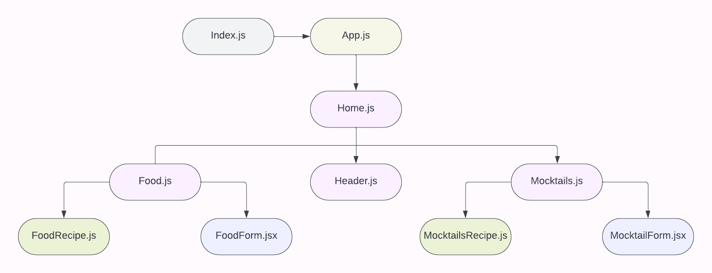
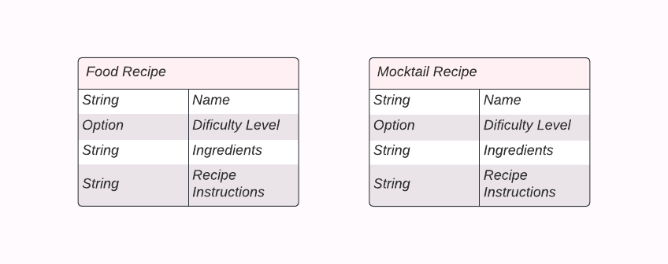

# Food Diaries

### Social Media

[Facebook](http://www.facebo.com)
[Instagram](http://www.instaa.com)
[Twitter](http://www.twitt.com)

## Description

I've created a food application that has 2 different sections. One section will lead to multiple different food images that are clickable. Once clicked, you will see the recipes difficulty level, ingredients needed for the recipe, and a list of directions on how to make the recipe. The other section will be the same except it will portray mocktail images with the recipe of that mocktail. If a follower lands on a recipe that they feel needs to be altered, there will be a tab to update the recipe.

## Component Hierarchy Diagram

## Entity Relationship Diagram

## Trello Link

[Food Diaries Status](https://trello.com/invite/b/2Vfdtfja/ATTI35adf591a08c0404513406dc21ea80b7A5365C28/food-diaries)
